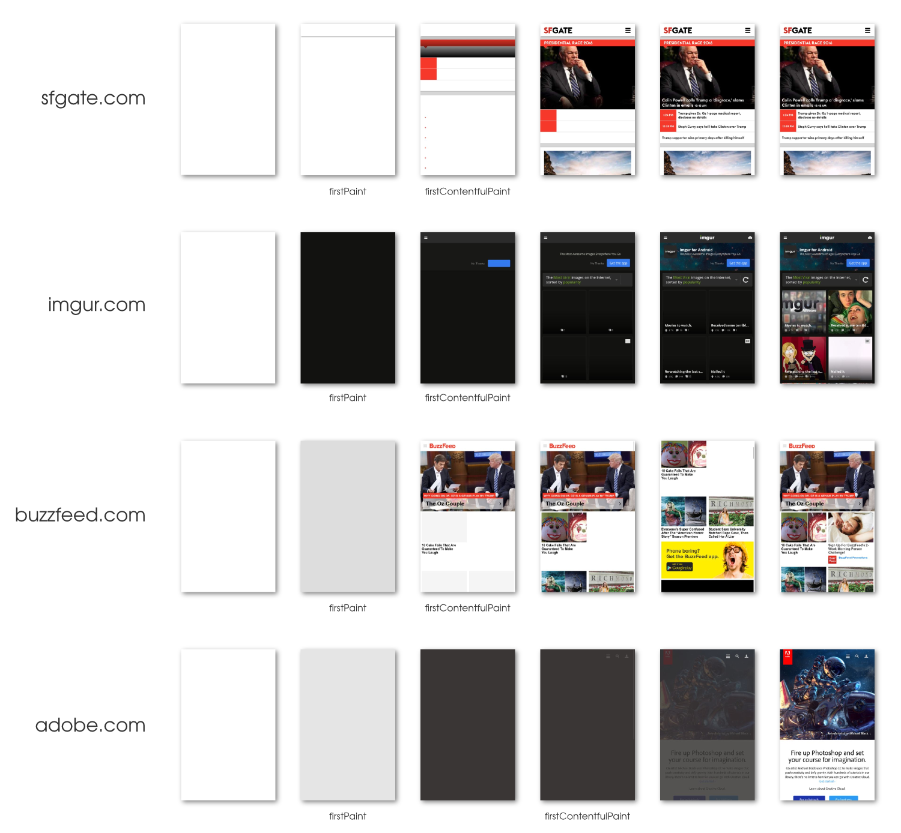

# PerformanceFirstPaintTiming & PerformanceFirstContentfulPaintTiming

Web developers require more information on page load performance in the wild. 
There isn’t ONE loading metric i.e. there isn’t a single moment in time that can properly capture the "loading experience".
We propose a set of key Progress Metrics to capture the series of key moments during pageload which developers care about
For detailed motivation, see [Why First Paint? doc](https://docs.google.com/document/d/1wdxSXo_jctZjdPaJeTtYYFF-rLtUFxrU72_7h9qbQaM/edit)

First Paint (FP), is the first of these key moments. Followed by First Contentful Paint (FCP).
(And possibly, in the future, First Meaningful Paint i.e. FMP)

*First Paint* is the DOMHighResTimeStamp reporting the time when the browser first painted anything non-white after a navigation. This is the first key moment developers care about in page load – when the browser has started to render the page.

*First Contentful Paint* is the DOMHighResTimeStamp reporting the time when the browser first painted any text, image, canvas, or SVG. This is the first time users could start consuming page content.


We propose introducing:

* `PerformanceFirstPaintTiming` interface extending the PerformanceEntry interface, to report the time for first paint.
* `PerformanceFirstContentfulPaintTiming` interface extending the PerformanceEntry interface, to report the time for first contentful paint.

```javascript
interface PerformanceFirstPaintTiming : PerformanceEntry {};

interface PerformanceFirstContentfulPaintTiming : PerformanceEntry {};

```

Entries will have a `name` as "FirstPaint" and "FirstContentfulPaint" respectively, an `entryType` of "paint", a `startTime` is the `DOMHighResTimeStamp` of paint, and `duration` of 0.

## Computation
The browser has performed a "paint" when it has prepared content to be drawn to the screen.

More formally, we consider the browser to have "painted" a document when it has updated "the rendering or user interface of that Document and its browsing context to reflect the current state". See the HTML spec's section on the event loop processing model – [section 7.12](https://html.spec.whatwg.org/multipage/webappapis.html#event-loop-processing-model).

`firstPaint` reports the time since `navigationStart` until the first time the browser paints anything non-white.

`firstContentfulPaint` reports the time since `navigationStart` until the first time the browser paints any text, image, non-white canvas or SVG. This includes text with pending webfonts.

## Usage

```javascript

var observer = new PerformanceObserver(function(list) {
  var perfEntries = list.getEntries();
  for (var i = 0; i < perfEntries.length; i++) {
     // Process entries
     // report back for analytics and monitoring
     // ...
  }
});

// register observer for long task notifications
observer.observe({entryTypes: ["firstPaint", "firstContentfulPaint"]});

```

## Examples

These examples are hand annotated, based on the definitions given above and in the [`firstContentfulPaint`](https://github.com/tdresser/time-to-first-contentful-paint/blob/master/README.md) explainer.



Some rough bulk data can be seen [here](https://docs.google.com/spreadsheets/d/1i0-tOtZP21m3DjBJflUJYao9-WAKwWV2p9WFlVhVivg/edit#gid=1447332636) or [here](https://docs.google.com/spreadsheets/d/1nGauGA3EvN8NBC3ErWjLd8Bz-NzmmEa6q6UP5KhfgeA/edit#gid=0). This data was collected using a somewhat different definition than we're currently using – it includes white paints in `firstPaint` and only looks at text and image paints for `firstContentfulPaint`.

## TODO
* More rigourously define what we mean by "paint".
